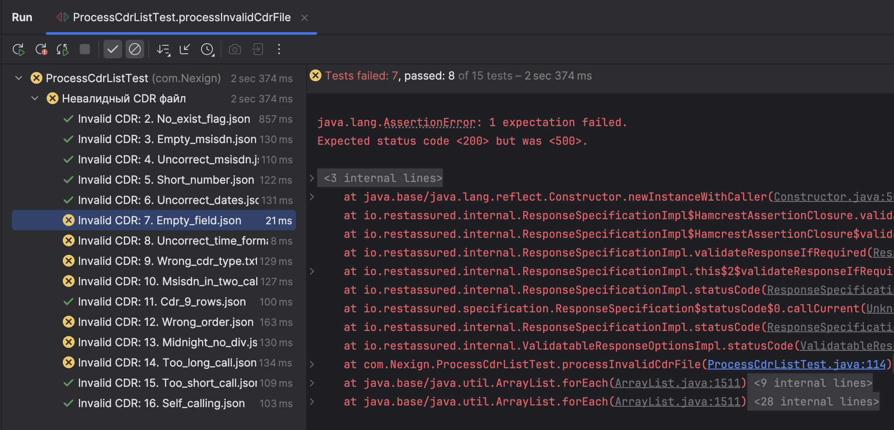

## 1. Автотесты на API сервиса с использованием RestAssured

Опишем, какие эндпоинты у нас есть для дальнейшего их покрытия. 

1. Коммутатор
   - POST http://localhost:8080/generate
   - DELETE http://localhost:8080/truncate
2. BRT
   - POST http://localhost:8081/processCdrList
3. HRS
   - POST http://localhost:8082/tarifficateCall
   - GET http://localhost:8082/monthTariffication/11
4. CRM
   - POST http://localhost:8083/manager/subscriber/add
   - GET http://localhost:8083/manager/subscriber/{msisdn}/fullinfo
   - PATCH http://localhost:8083/manager/subscriber/{msisdn}/update
   - DELETE http://localhost:8083/manager/subscriber/{msisdn}/delete
   - GET http://localhost:8083/subscriber/{msisdn}/getbalance
   - GET http://localhost:8083/manager/subscriber/{msisdn}/gettariff
   - PUT http://localhost:8083/manager/subscriber/{{msisdn}}/changetariff
   - PUT http://localhost:8083/subscriber/{msisdn}/changebalance

#### Полученные автотесты на API по заданию: 
1) Коммутатор
   
  а) Лежат в файле CommutatorApiTest.
  
  b) Содержат 3 теста и последующую проверку ответа сервера: вызов API \generate, вызов API \truncate и повторный вызов API \generate при уже сгенерированных данных.
  
  c) Тесты прошли успешно, результат на скриншоте в Test_results.

2) BRT
   
   а) Сервис содержит одну API и проверяется в рамках задания 2.
   
3) HRS
   
  а) Лежат в файле HrsApiTest.

  b) Содержат по 2 теста на каждый эндпоинт - позитивный и негативный вариант. Для POST \tarificateCall это отправка запроса с корректным телом запроса, ответ 200 ОК. Далее отправка с некорректным телом, ответ 400. Запрос GET \mounthTarification вызываю для тарифа с id = 11 и id = 12. Для помесячного тарифа ответ корректный 200, для классики 400 и расшифровка ошибки.
  
  c) Тесты прошли успешно, результат на скриншоте ниже.
  
  d) Возможные доработки: расширить количество негативных сценариев для эндпоинта \tarificateCall, добавить проверку актуальных параметров тарифа для эндпоинта \mounthTarification

4) CRM
   
  а) Автотесты разделены на три категории и лежат в файлах BalanceApiTest, SubscriberCrudTest и TariffApiTest. В них лежат соответственно тесты для работы с балансом абонента, самими абонентами и их тарифами.

  Файл SubscriberCrudTest содержит 4 позитивных теста и 4 негативных по CRUD операциям с абонентами. Тесты сделаны независимыми, создание абонента вынесено в предусловия.

  Файл TariffApiTest содержит 2 позитивных теста для операций получение и редактирование тарифа у тестового абонента. 

  Файл BalanceApiTest содержит 2 позитивных и 2 негативных теста на получение и обновление баланса у тестового абонента.
  
  b) Успешность тестов пока не проверена, так как API CRM еще не реализован. В данный момент покрыты по 1-2 критичных сценария для каждого эндпоинта, по готовности сервиса количество проверок может быть расширено и поставлено на регресс. 

Тесты на API CRM написаны на основании [swagger-спецификации](https://app.swaggerhub.com/apis/kbutakova/CRM/1.0), все ручки собраны в postman коллекции (прикреплена к проекту).

## 2. Автотесты на валидацию CDR сервисом BRT

Перед написанием автотеста валидация CDR сервисом BRT была протестирована вручную. Результаты проверки лежат в [документе](https://docs.google.com/spreadsheets/d/1Z3PP9ipYX9FlLFWhs0BKGFT_9WMVagtTPuESBTi5ByA/edit?usp=sharing), по результатам проверки заключено, что сервис не всегда корректно отрабатывает при негативных сценариях, так как при разработке предполагалось, что BRT уверен в корректности данных, которые получает от CDR. Заводить баг и отправлять на доработку разработчику учитывая сроки и время разработки не считаю целесообразным. 

Для "подкладывания" искусственно сгенерированных разработчиком реализована ручка /processCdrList, за что отдельное спасибо. 

Автотесты лежат в /src/test/java/com/Nexign/ProcessCdrListTest. В тестовом сценарии реализовано 3 автотеста: обработка валидного CDR, обработка 15-ти невалидных CDR и обработка пустого CDR.  

План тестирования для написания автотеста:
- Предусловия: 
Сгенерированные файлы для тестирования лежат в папке [Файлы для тестирования BRT](https://drive.google.com/drive/folders/17oAoHgWyYd8rFhmL_HNaUA-M7aJ1ccWh)
В проекте тестовые данные лежат в /src/test/java/com/Nexign/TestResources.

- Сценарий:
  1. Считать файл с тестовыми данными из репозитория
  2. Сформировать тело запроса с содержимым из файла json
  3. Отправить сгенерированный CDR в BRT запросом POST http://localhost:8081/processCdrList
  4. Сравнивать код ответа и тело ответа с ожидаемым:
     а) Для валидного файла код ответа 200 ОК, тело ответа в формате
     [
    {
        "tariffBalanceChange": -50,
        "balanceChange": -268.5
    },
    {
        "tariffBalanceChange": 0,
        "balanceChange": -785.0
    }, .....
     b) Для невалидного файла код ответа 400 Bad Request / сообщение об ошибке
     с) Для пустого файла код ответа 500 Internal Server Error

## 3. Автотесты на e2e процесс

Автотесты написаны на основании [ручных тест-кейсов на e2e сценарии](https://docs.google.com/spreadsheets/d/1YN9u7vvXznJ5jr4QPFUxrisM_9kSW0VQVI7haG0EqNI/edit?gid=0#gid=0)

Автотесты лежат в папке src/test/java/com/Nexign/e2e - два файла: для тарифа "Классика" и "Помесячный" соответственно.

Креды для подключения к базам данных Postgres лежат в переменных окружения

## 4. Автоматизация создания тестовых CDR

В папке src/main/java/com/Nexign/utils/ лежит файл CdrGenerator.java. Предназначен для автоматической генерации случайных CDR-файлов. В результате работы алгоритма получаем следующие файлы:

1. cdr_valid.json – файл с валидными 10 записями CDR 
2. cdr_bad_flag.json – файл с одной записью с некорректным флагом
3. cdr_invalid_dates.json – файл с одной записью с некорректной датой (дата начала позже даты конца)
4. cdr_invalid_msisdn.json – файл с некорректным форматом номера телефона 
4. cdr_missing_field.json – файл с пропущенным полем
5. cdr_nonexistent_operator.json – несуществующий оператор (некорректный номер)

Код гибкий, позволяет добавлять любые другие типы некорректных проверок для генерации данных. Исходные данные и требования лежат по ссылке https://docs.google.com/spreadsheets/d/1Z3PP9ipYX9FlLFWhs0BKGFT_9WMVagtTPuESBTi5ByA/edit?usp=sharing

Записи в CDR файле расположены в хронологическом порядке, записи пересекающие рубеж суток 00:00 разделены на две записи.

В данный момент генерация ведется по рандомным msisdn, но можно взять те, что лежат у нас в базе и генерировать из мапы реальных наших абонентов.

## Результаты тестирования 

### API Коммутатор. 

### API BRT. 

После внесения изменений разработчиком часть кейсов стала корректно обрабатываться. Ожидаем, что все негативные кейсы будут отлавливаться

### API HRS. 

### API CRM. 

Сервис в разработке

### Allure report

Для того, чтобы открыть allure report, я:

0. Подключила зависимости и плагины 
1. Генерирую отчет allure generate allure-results -o allure-report --clean
2. Перехожу в папку с отчетом cd allure-report
3. Запускаю сервер для просмотра python3 -m http.server 8080
4. Открываю в браузере http://localhost:8080/ 

